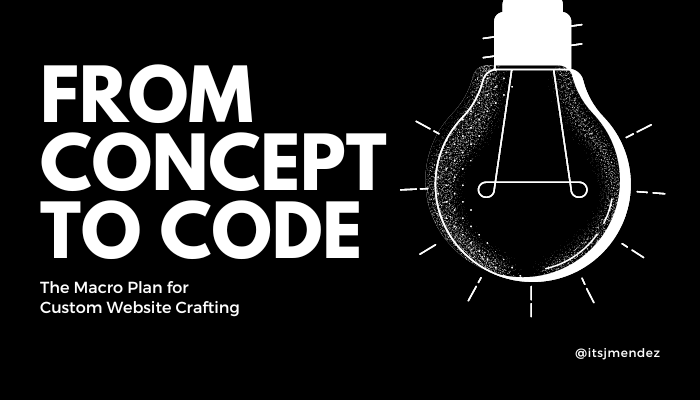

# PROJETO FINAL ANALISE E DESENVOLVIMENTO DE SISTEMAS



> PROJETO FINAL ANALISE E DESENVOLVIMENTO DE SISTEMAS

## 💻 Pré-requisitos

Antes de começar, verifique se você atendeu aos seguintes requisitos:

* Você tem uma máquina <Windows,Linux e macOS>.

## 🚀 PROJETO FINAL ANALISE E DESENVOLVIMENTO DE SISTEMAS

Instalação das bibliotecas, siga estas etapas:

Bibliotecas:
```
npm install express

npm install mongoose

npm install mongodb

npm install nodemon --save-dev

npm install dotenv

npm install body-parser

npm install

```


## ☕ Usando o PROJETO FINAL ANALISE E DESENVOLVIMENTO DE SISTEMAS

Para usar o PROJETO FINAL ANALISE E DESENVOLVIMENTO DE SISTEMAS, siga estas etapas:

Apenas importe o arquivo para dentro do POSTMAN e por lá faça as requições que deseja testar.


## 🌏 Mapa mental


## 📫 Contribuindo para o Projeto de PROJETO FINAL ANALISE E DESENVOLVIMENTO DE SISTEMAS

Para contribuir com Projeto Projeto de PB_SPRINT 2 API SERVER-REST, siga estas etapas:

1. Bifurque este repositório.
2. Crie um branch: `git checkout -b <nome_branch>`.
3. Faça suas alterações e confirme-as: `git commit -m '<mensagem_commit>'`
4. Envie para o branch original: `git push origin <nome_do_projeto> / <local>`
5. Crie a solicitação de pull.

Como alternativa, consulte a documentação do GitHub em [como criar uma solicitação pull](https://help.github.com/en/github/collaborating-with-issues-and-pull-requests/creating-a-pull-request).

## 📝 Licença

Esse projeto está sob licença. Veja o arquivo [LICENÇA](LICENSE.md) para mais detalhes.
